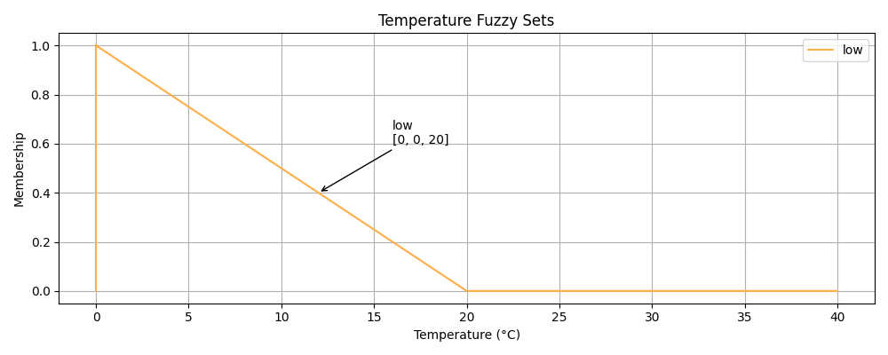
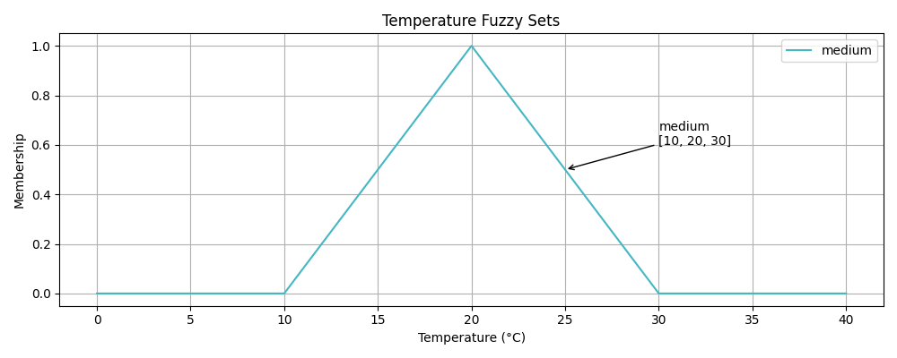
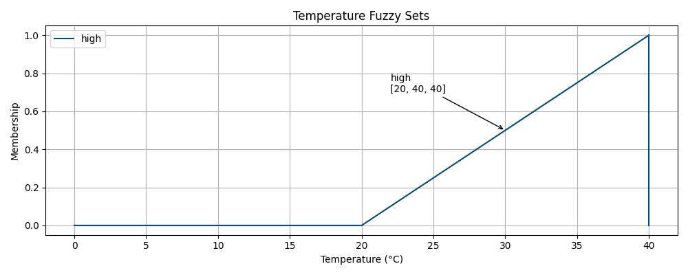
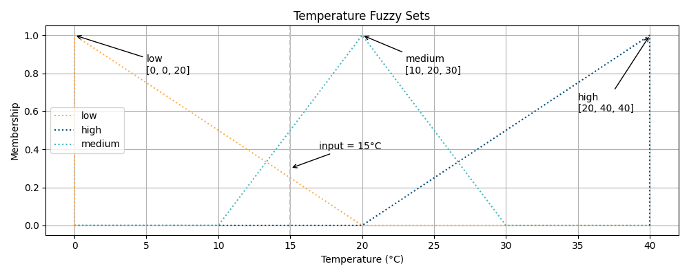

# 模糊控制(Fuzzy Control)
本課程主要簡介模糊控制的核心概念，透過 Python 套件 scikit-fuzzy 進行實作的練習，搭配實際的運算驗證模糊控制的理解。其中，範例內容以一個簡單的風扇轉速控制為例，透過溫度決定風扇的行為，用以了解模糊控制的各項核心概念。

## 模糊控制步驟
輸入數值 →（模糊化）→ 模糊語意 →（推論）→ 模糊結果 →（解模糊化）→ 實際控制輸出


## 名詞定義
| 中文名詞 | 英文名詞 | 定義 |
|----------|---------|------|
| 知識庫    | Knowledge Base        | 整個系統的知識總集合，包含模糊集合與規則庫    |
| 規則庫    | Rule Base             | 決策用的 if–then 規則集合                   |
| 模糊集合  | Fuzzy Set             | 多個隸屬函數所定義的集合                     |
| 隸屬函數  | Membership Function   | 用數學方法描述某個模糊集合的程度              |
| 模糊化    | Fuzzification         | 使用模糊集合將數值轉為具有程度分別模糊的概念   |
| 推論      | Inference             | 根據規則庫進行決策計算                       |
| 解模糊化  | Defuzzification       | 根據模糊集合將模糊結果轉回具體數值            |


## 定義輸入輸出
輸入：0 - 40 (度)  
輸出：0 - 100 (%)


## 建立模糊集合(Fuzzy Sets)
在本範例中，需要對溫度與風扇轉速分別建立模糊集合，以溫度的模糊集合為例，模糊集合允許一個溫度同時屬於多個集合，並以 0 到 1 的隸屬度 membership 表示其程度。這些模糊集合通常透過三角形函數（triangular membership function）或梯形函數（trapezoidal membership function）來建模，使溫度在不同區間之間能夠平滑過渡，盡量避免突然的變化。

在本範例中，溫度被劃分為三個模糊集合：
* **Low（低溫）**：在低溫區間具有較高隸屬度，隨溫度上升逐漸下降
* **Medium（中溫）**：在中間溫度區域達到最大隸屬度，並向兩側平滑遞減
* **High（高溫）**：在高溫區間具有較高隸屬度，隨溫度上升逐漸增加

<p align="center">
  
  
  
</p>

在完整的 Temperature Fuzzy Sets 中，從完整圖中可以觀察到三個模糊集合之間具有重疊區域（overlap），這種設計能讓系統在進行模糊推論時（如風扇轉速控制）產生更平滑且合理的輸出結果，避免因分類邊界過於明確而造成不連續的行為。

<p align="center">
  
</p>


## 建立模糊規則庫(Fuzzy Rules)
```
IF 溫度是 Low → 風扇轉速是 Low
IF 溫度是 Medium → 風扇轉速是 Medium
IF 溫度是 High → 風扇轉速是 High
```

## 模糊化

## 解模糊化


## 安裝環境
```bash
pip install numpy==2.4.4 networkx==3.6.1 scipy==1.17.1 scikit-fuzzy==0.5.0
```


## 課後練習
請製作一個平衡光線的燈光控制功能，輸入為環境光的強度，範圍是0 ~ 1000 lux，輸入為燈光的強度，範圍是0 ~ 100%。請設計這個系統並自行驗算。